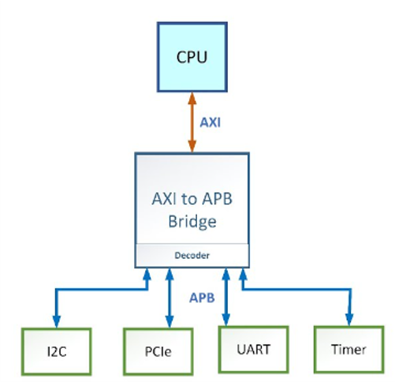

# Design and Simulation of a 32-bit RISC V Core and APB
Microprocessors can be of different architectures: Single-cycle, multi-cycle and pipelined. Multi-cycle architecture defines its input and output datapath and controls. SystemVerilog can be used to design multi-cycle architecture.   

RISC-V is an open standard instruction set architecture based on RISC principles. It is free-for-all, and can be implemented easily by using SystemVerilog. RISC-V has its own way of defining instructions in assembly and machine languages. Codes are compiled in SystemVerilog according to RISC-V standards.   

In this project, instructions have been compiled in RISC-V architecture using SystemVerilog.
  

  
APB: an industry standard protocol that is used to communicate with peripheral components.  
<ul>
  <li> APB bridge is the master </li> 
  <li> Peripherals are the slave </li>  
  </ul>
 

  
  

Youtube Link:  <a href ="https://youtu.be/66s9SdI0HrA">EVM Demonstration</a> 
Thingspeak channel Link: <a href="https://thingspeak.com/channels/1843139">EVM channel</a>  

